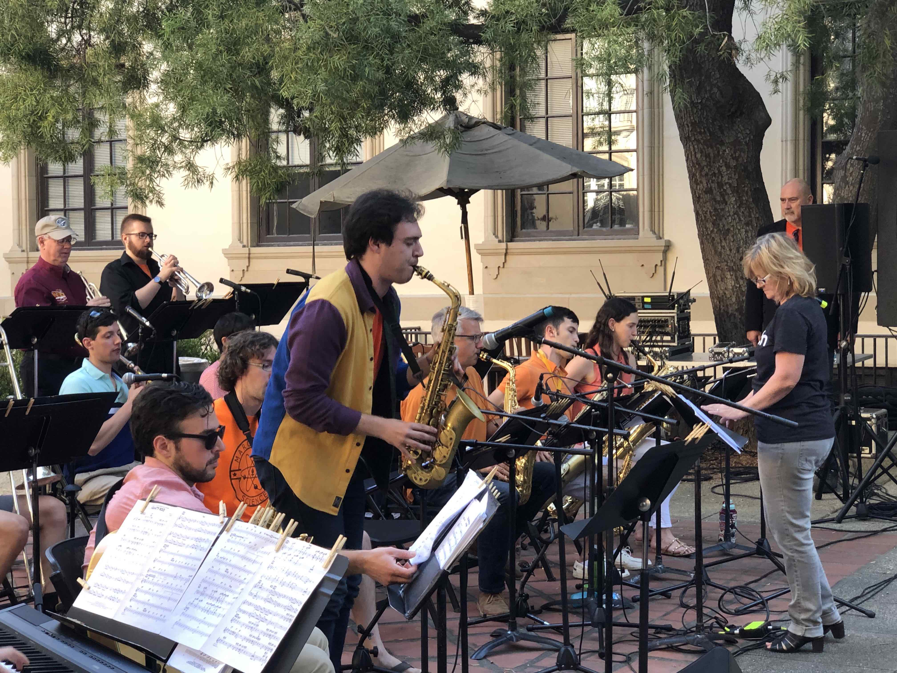

<h2 class="post-title">About Me</h2>

I am currently a first year graduate student in physics at Caltech. Before this year, I was an undergraduate student at Harvard University, where I completed my BA in Physics and Astrophysics with Honors. While at Harvard, I worked with Douglas Finkbeiner on probabilistic cataloging (see <a href="https://richardfeder.github.io/research">Research</a> for more information). I also worked with Daniel Eisenstein on target selection for DESI's Bright Galaxy Survey (BGS). My research experiences in college helped foster my interest in how statistics and computational methods can enhance the study of astronomy and cosmology. I'm originally from Great Neck, New York.  

  When I am not doing research, I enjoy playing music. I play sax in the Caltech Jazz Band currently. I also enjoy hiking and biking. 
  <figure>
  
    <figcaption>
      Me playing at the Caltech Jazz Festival, 2019.
    </figcaption>
  </figure>

  
