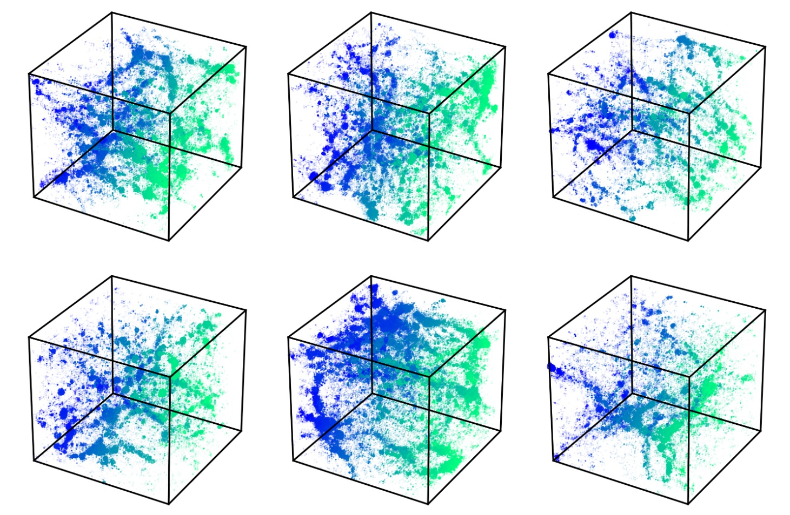

<!-- <input type="button" onClick="document.getElementById('pcat-de').scrollIntoView();" />

<input type="button" onClick="document.getElementById('gan').scrollIntoView();" />

<input type="button" onClick="document.getElementById('gan').scrollIntoView();" /> -->

<!-- 
 -->
<!-- 
    -->
  <h2 class="post-title">PCAT-DE: Reconstructing Pointlike and Diffuse Signals in Astronomical Images Using Spatial and Spectral Information</h2>

  <a>Accepted to AJ, <a href="https://iopscience.iop.org/article/10.3847/1538-3881/ace69b">link here</a>.
   
  

    Abstract: Observational data from astronomical imaging surveys contain information about a variety of source populations and environments, and their complexity will increase substantially as telescopes become more sensitive. Even for existing observations, measuring the correlations between pointlike and diffuse emission can be crucial to correctly inferring the properties of any individual component. For this task, information is typically lost, because of conservative data cuts, aggressive filtering, or incomplete treatment of contaminated data. We present the code PCAT-DE, an extension of probabilistic cataloging, designed to simultaneously model pointlike and diffuse signals. This work incorporates both explicit spatial templates and a set of nonparametric Fourier component templates into a forward model of astronomical images, reducing the number of processing steps applied to the observed data. Using synthetic Herschel-SPIRE multiband observations, we demonstrate that point-source and diffuse emission can be reliably separated and measured. We present two applications of this model. For the first, we perform point-source detection/photometry in the presence of galactic cirrus and demonstrate that cosmic infrared background galaxy counts can be recovered in cases of significant contamination. In the second, we show that the spatially extended thermal Sunyaev–Zel'dovich effect signal can be reliably measured even when it is subdominant to the pointlike emission from individual galaxies.
  

  <figure>
  
   <figcaption>
    10' × 10' cirrus-free mock SPIRE observations toward galaxy cluster RX J1347.5-1145. The columns show (going from left to right) the input SZ effect signal, observed maps, median CIB model, and difference between observed maps and CIB model. By fitting both SZ and CIB simultaneously we can account for the presence of sub-mm point sources without overfitting the underlying SZ signal. The maps in the rightmost column are shown for visualization purposes only.
    </figcaption>
  </figure>

 

<!-- 
 -->
<!-- 
    -->
  <h2 class="post-title">Measurement of the Relativistic Sunyaev–Zeldovich Correction in RX J1347.5-1145</h2>

  Co-led with Victoria Butler, Accepted to AJ, <a href="https://iopscience.iop.org/article/10.3847/1538-4357/ac6c04">link here</a>.
   
  

    Abstract: We present a measurement of the relativistic corrections to the thermal Sunyaev–Zel'dovich (SZ) effect spectrum, the rSZ effect, toward the massive galaxy cluster RX J1347.5-1145 by combining submillimeter images from Herschel-SPIRE with millimeter wavelength Bolocam maps. Our analysis simultaneously models the SZ effect signal, the population of cosmic infrared background galaxies, and the galactic cirrus dust emission in a manner that fully accounts for their spatial and frequency-dependent correlations. Gravitational lensing of background galaxies by RX J1347.5-1145 is included in our methodology based on a mass model derived from the Hubble Space Telescope observations. Utilizing a set of realistic mock observations, we employ a forward modeling approach that accounts for the non-Gaussian covariances between the observed astrophysical components to determine the posterior distribution of SZ effect brightness values consistent with the observed data. We determine a maximum a posteriori (MAP) value of the average Comptonization parameter of the intracluster medium (ICM) within R2500 to be 〈y〉2500 = 1.56 × 10−4, with corresponding 68% credible interval [1.42, 1.63] × 10−4, and a MAP ICM electron temperature of 〈Tsz〉2500 = 22.4 keV with 68% credible interval spanning [10.4, 33.0] keV. This is in good agreement with the pressure-weighted temperature obtained from Chandra X-ray observations, 〈Tx,pw〉2500 = 17.4 ± 2.3 keV. We aim to apply this methodology to comparable existing data for a sample of 39 galaxy clusters, with an estimated uncertainty on the ensemble mean 〈Tsz〉2500 at the ≃ 1 keV level, sufficiently precise to probe ICM physics and to inform X-ray temperature calibration.
  

  <figure>
  
      
   <figcaption>
      Left: SZ spectrum measurements. Right: Constraints on ICM temperature given relativistic corrections to the tSZ spectrum.
    </figcaption>
  </figure>

  

  <h2 class="post-title">Non-linear 3D Cosmic Web Simulation with Heavy-Tailed Generative Adversarial Networks</h2>  
  In collaboration with <a href="https://science.jpl.nasa.gov/people/PBerger/">Philippe Berger</a> and <a href="https://www.cita.utoronto.ca/~gstein/">George Stein</a>. Accepted to Physical Review D, arXiv link <a href="https://arxiv.org/abs/2005.03050">here</a>.
   
  

    Many inference problems in cosmology incorporate information from simulations when making comparisons to observational data. Comparing data to simulations (e.g., N-body, hydrodynamical, etc.) can be challenging when the data are high-dimensional and when generating the simulations is computationally expensive. Some summary statistics can be analytically derived (the power spectrum being one example), but for higher order statistics and covariances these analytical prescriptions often have limitations. I am interested in the ways deep generative modeling can be used to bridge the gap between expensive simulations and robust cosmological inference.
  

  

    My collaborators and I investigated how well generative adversarial networks (GANs) could emulate evolved dark matter density fields trained on ensembles of N-body simulations. Deep learning methods excel at modeling non-linear data, so by emulating directly to the data space, summary statistics like the power spectrum and bispectrum can be predicted well into the small-scale, non-linear regime where analytic methods fail but where there is often more constraining power. In addition to reproducing the two- and three-point statistics of GADGET dark matter simulations (and their covariances), we demonstrated the capability for these models to interpolate in redshift space. Work by others following this publication has extended this deep generative modeling approach to interpolate cosmological parameters and model other fields such as those from hydrodynamical simulations.
  

<!-- 
 -->

  

  

  <figure>
<!--    -->
  
  </figure>
    <figcaption>
      Visualization of cGAN-generated samples, interpolated from redshift z=3 to z=0. Voxels with higher density are more red and less transparent.
    </figcaption>
  

  

 
<!-- 
 -->

<h2>Multi-band Probabilistic Cataloging: A Joint Fitting Approach to Point-source Detection and Deblending</h2>
Supervised by <a href="https://faun.rc.fas.harvard.edu/nebel/dfink//">Douglas Finkbeiner</a>, in collaboration with <a href="http://portillo.ca/">Stephen Portillo</a> and <a href="tansudaylan.com">Tansu Daylan</a>  

Abstract: Probabilistic cataloging (PCAT) outperforms traditional cataloging methods on single-band optical data in crowded fields. We extend our work to multiple bands, achieving greater sensitivity (∼0.4 mag) and greater speed (500×) compared to previous single-band results. We demonstrate the effectiveness of multiband PCAT on mock data, in terms of both recovering accurate posteriors in the catalog space and directly deblending sources. When applied to Sloan Digital Sky Survey (SDSS) observations of M2, taking Hubble Space Telescope data as truth, our joint fit on r- and i-band data goes ∼0.4 mag deeper than single-band probabilistic cataloging and has a false discovery rate less than 20% for F606W ≤ 20. Compared to DAOPHOT, the two-band SDSS catalog fit goes nearly 1.5 mag deeper using the same data and maintains a lower false discovery rate down to F606W ∼ 20.5. Given recent improvements in computational speed, multiband PCAT shows promise in application to large-scale surveys and is a plausible framework for joint analysis of multi-instrument observational data. https://github.com/RichardFeder/multiband_pcat.

  <a href="https://arxiv.org/abs/1907.04929">Check out our paper on the arXiv</a> (August 2019) and the <a href="https://iopscience.iop.org/article/10.3847/1538-3881/ab74cf">published version</a>. And check out <a href="https://aasnova.org/2020/04/24/a-stellar-method-of-catalog-creation/?fbclid=IwAR1m4kUkcipyRn3RGrPtU7uMz-yFy7W6n5A1v0L906mKJpcZwkgiYN3ig8I">this article</a> by AAS Nova about the publication!

<figure align="center">

</figure>

<h2>Other selected publications</h2>

   
